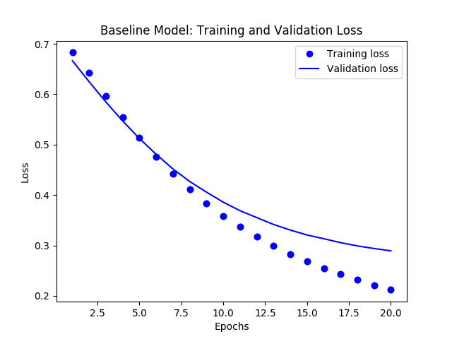
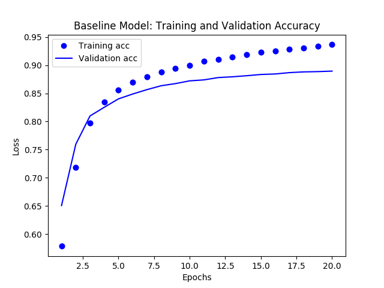
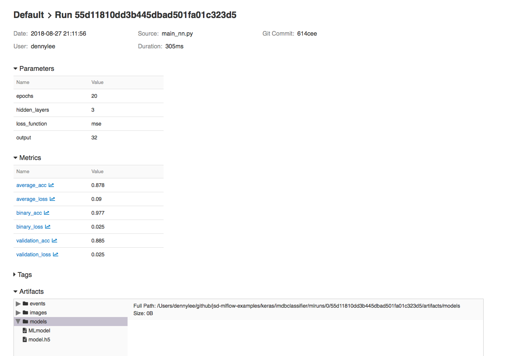

# jsd-mlflow-examples
This is a collection of MLflow project examples that you can directly run with mlflow CLI commands or directly using Python.

The goal is provide you with additional set of samples, focusing on machine learning and deep learning examples, to get you quickly started on MLFlow. 
In particular, I focus on [Keras](https://keras.io) and borrow and extend examples
from Francois Cholllet's book: [_Deep Learning with Python_](https://www.manning.com/books/deep-learning-with-python?a_aid=keras&a_bid=76564dff)

## 1. Keras MLP Binary Classification Model.

This is a simple Keras neural network model with three layers, one input, one hidden,
and one output layer. It's a simple linear model: `y=Mx`. Given a random numbers of X values,
it learns to predict it's Y value, from a training set.

This Multi-layer Perceptron (MLP) for binary classification model's sources have been modified from this [gist](https://gist.github.com/candlewill/552fa102352ccce42fd829ae26277d24). 
You can use other network models from this gist in a similar fashion to experiment. 

The arguments to run this simple MLP Keras network model are as follows:

* `--drop_rate`: Optional argument with a default value is `0.5`.
* `--input_dim  `: Input dimension. Default is `20`.
* `--bs`: dimension and size of the data. Default is `(1000, 20)`
* `--output`: Output to connected hidden layers. Default is `64`.
* `--train_batch_size`: Training batch size. Default is `128`
* `--epochs`: Number of epochs for training. Default is `20`.

To experiment different runs to evaluate metrics, you can alter the arguments, for example, 
expand the size of network by providing more `output` to the hidden layers. Or you 
may change the `drop_rate` or `train_batch_size` — all will alter the loss and 
accuracy of the network model.

To run the current program with just python and yet log all metrics, use
the following command:

`python keras/keras_nn_model.py`

`python keras/keras_nn_model.py --output=128 --epochs=10`

`python keras/keras_dnn/main_nn.py --output=128 --epochs=10`

It will log metrics and parameters in the `mlruns` directory. 

Alternatively, you can run using the `mlflow` command.

`mflow run . e -keras-nn-model`

`mlflow run . -e keras-nn-model -P drop_rate=0.3 -P output=128`

The next two examples are from [Deep Learning with Python](https://www.manning.com/books/deep-learning-with-python?a_aid=keras&a_bid=76564dff).
While the Jupyter notebooks can be found [here](https://github.com/fchollet/deep-learning-with-python-notebooks), I have modified the code 
to tailor for use with MLflow. The description and experimentation remain the same, hence it fits well with using MLflow to experiment
various capacity of networks layers and suggested parameters to evaluate the model.


## 2. Classifying Movie Reviews: a Keras binary classification example.

This part comprises of code samples found in Chapter 3, Section 5 of [Deep Learning with Python](https://www.manning.com/books/deep-learning-with-python?a_aid=keras&a_bid=76564dff). 
The borrowed code from the book has been modularized and adjusted to work with MLflow, and it fits well since Francois
suggests some experimentation parameters to tweak to see how the model metrics change.

Two-class classification, or binary classification, may be the most widely applied kind of machine learning problem. In this example, we 
will learn to classify movie reviews into "positive" reviews and "negative" reviews, just based on the text content of the reviews.

This example creates two types of models for you to work with. First, it creates a baseline model with default
parameters:

 * loss function as `rmstrop`
 * `binary_crossentropy` for metrics
 * learning rate as 0.001
 * a Keras neural network model with
    * An input layer with  input_shape (10000, )
    * 1 hidden layer with output = 32 
    * 1 Output layer with output = 1
    * All layers use `relu` as an activation function except for `sigmod` that is used in the final output layer.
  * epochs = 20; batch_size=512
 
 And the second model can me created for experimenting by changing any of the these parameters to measure the metrics:
 
  * Use 2 or more hidden layers
  * Use 4, 8, 12 or 16 epochs
  * Try hidden layers with output 32, 64 or 128 and see if that affects the metrics
  * Try to use the `mse` loss function instead of `binary_crossentropy`.
  
  In both cases, the model will create images for training and validation loss/accuracy images in the images directory
  
  
  
  
  
 ### How to Use MLflow to Experiment, Log Metrics and Artifacts
 
 To run the current program with just python and default or supplied parameter and yet log all metrics, use
the following command:

`cd imdbclassifier`

`python main_nn.py`

To experiment different runs, with different parameters suggested above, and evaluate new metrics, you can alter the arguments. For example, 
expand the size of network by providing more `output` to the hidden layers. Or you 
may change the `hidden_layers` or `epochs` or `loss` function — all will alter the loss and 
accuracy of the network model. For example,

```
python main_nn.py  # hidden_layers=1, epochs=20 output=16 loss=binary_crossentropy
python main_nn.py --hidden_layers=3 --output=16 --epochs=30 --loss=binary_crossentropy 
python main_nn.py --hidden_layers=3 --output=32 --epochs=30 --loss=mse
```

It will log metrics and parameters in the `mlruns` directory. 

Alternatively, you can run using the `mlflow` command.

**Note**: `mlflow run..` may take longer as it needs to create and setup an environment by and download and
installing dependency packages listed in `conda.yml`

`mlflow run keras/imdbclassifier -e main`

`mlflow run keras/imdbclassifier -e main -P hidden_layers=3 -P output=32 -P epochs=30 -P loss=mse`

 To view the output of either runs, launch the mlflow ui:
 
 `mlflow ui`
 
 These runs will not only log metrics for loss and accuracy but also log graphs generated from `matplotlib` for 
 perusal as part of visual artifacts.
 
 
 
 Finally, you can run this in a Jupyter Notebook: 
 
 
 
 ### How to Use MLflow to Load Saved Model
 When executing your test runs, the models used for these runs are also saved via the `mlflow.keras.log_model(model, "models")` within `train_nn.py`.  Once you have found a model that you like, you can re-use your model using MLflow as well.  Your Keras model is saved in HDF5 file format as noted in [MLflow > Models > Keras](https://mlflow.org/docs/latest/models.html#keras-keras).  
 
This model can be loaded back as a `Python Function` as noted noted in [`mlflow.keras`](https://mlflow.org/docs/latest/python_api/mlflow.keras.html#module-mlflow.keras) using `mlflow.keras.load_model(path, run_id=None)`.

To execute this, you load the model you had saved within MLflow by going to the MLflow UI, selecting your run, and copying the path of the stored model as noted in the screenshot below.  



Using the code sample `reload_nn.py`, you can load your saved model and re-run it using the command:

```
python reload_nn.py --hidden_layers=3 --output=32 --load_model_path='/Users/dennylee/github/jsd-mlflow-examples/keras/imdbclassifier/mlruns/0/55d11810dd3b445dbad501fa01c323d5/artifacts/models'
```
```
mlflow run keras/imdbclassifier -e reload -P output=4 -P load_model_path=/Users/jules/jsd-mlflow-examples/keras/imdbclassifier/keras_models/178f1d25c4614b34a50fbf025ad6f18a
```

### How to Reproduce a Run or an Experiment
As part of machine development life cycle, reproducibility of any experiment by team members or ML developers is imperative. Often you will want to either retrain or reproduce a run from several past experiments to reproduce the results for sanity or audibility.

One way is to manually read the parameter from the MLflow UI for a particular `run_uuid` and rerun using `main_nn.py or reload_rn.py,` with the original parameters arguments.

Another preferred way is to simply use `run_uuid`, and use it with `reproduce_nn.py.` This command will fetch all the right hyper-parameters used for training the model and will recreate or reproduce 
the experiment, including building, training, and evaluating the model. To see the code how the new [Python tracking and experimental APIs](https://mlflow.org/docs/latest/python_api/mlflow.tracking.html) are used, read the source `reproduce_nn.py.`

You can run these either of two ways:

```
python reproduce_run_nn.py --run_uuid=7261d8f5ae5045d4ba16f9de58bcda2a
python reproduce_run_nn.py --run_uuid=7261d8f5ae5045d4ba16f9de58bcda2a [--tracking_server=URI]
```
Or

```
mlflow run keras/imdbclassifier -e reproduce -P run_uuid=7261d8f5ae5045d4ba16f9de58bcda2a
mlflow run keras/imdbclassifier -e reproduce -P run_uuid=7261d8f5ae5045d4ba16f9de58bcda2a [--tracking_server=URI]
```
The output from the above runs. By default the `tracking_server` defaults to
the local 'mlruns' directory.
...

The output from the above runs. By default the `tracking_server` defaults to
the local 'mlruns' directory.
```
...
Using TensorFlow backend.
run_uuid: 5374ba7655ad44e1bc50729862b25419
hidden_layers: 4
output: 4
epochs: 25
loss: mse
load model path: /tmp
tracking server: None
2018-09-12 10:25:24.378576: I tensorflow/core/platform/cpu_feature_guard.cc:141] Your CPU supports instructions that this TensorFlow binary was not compiled to use: SSE4.1 SSE4.2 AVX AVX2 FMA
Experiment Model:
Writing TensorFlow events locally to /var/folders/b7/01tptb954h5_x87n054hg8hw0000gn/T/tmpiva13sry

Train on 15000 samples, validate on 10000 samples
Epoch 1/25
15000/15000 [==============================] - 3s 189us/step - loss: 0.2497 - binary_accuracy: 0.5070 - val_loss: 0.2491 - val_binary_accuracy: 0.4947
...
```

### How to run the model
Now that you have a model, you can type in your own review by loading your model and executing it.  To do this, use the `predict_nn.py` against your model:

```
python predict_nn.py --load_model_path='/Users/dennylee/github/jsd-mlflow-examples/keras/imdbclassifier/mlruns/0/55d11810dd3b445dbad501fa01c323d5/artifacts/models' --my_review='this is a wonderful film with a great acting, beautiful cinematography, and amazing direction'
```

```
mlflow run keras/imdbclassifier -e predict -P load_model_path='/Users/jules/jsd-mlflow-examples/keras/imdbclassifier/keras_models/178f1d25c4614b34a50fbf025ad6f18a' -P my_review='this is a wonderful film with a great acting, beautiful cinematography, and amazing direction'
```

The output for this command should be something like:
```
Using TensorFlow backend.
load model path: /tmp/models
my review: this is a wonderful film with a great acting, beautiful cinematography, and amazing direction
verbose:  False
Loading Model...
Predictions Results:
[[ 0.69213998]]
``` 
 
### How Visualize TensorFlow Graphs with TensorBoard

If you have TensorBoard installed, you can also visualize the TensorFlow session graph created by the `train_models()` within the `train_nn.py`.  For example, after executing the statement `python main_nn.py`, you will see something similar to the following output:
```
Average Probability Results:
[0.30386349968910215, 0.88336000000000003]

Predictions Results:
[[ 0.35428655]
 [ 0.99231517]
 [ 0.86375767]
 ..., 
 [ 0.15689197]
 [ 0.24901576]
 [ 0.4418138 ]]
Writing TensorFlow events locally to /var/folders/0q/c_zjyddd4hn5j9jkv0jsjvl00000gp/T/tmp7af2qzw4

Uploading TensorFlow events as a run artifact.
loss function use binary_crossentropy
This model took 51.23427104949951  seconds to train and test.
```

You can extract the TensorBoard log directory with the line stating `Writing TensorFlow events locally to ...`.  That is, to run Tensorboard, you can run the following command:

```
tensorboard --logdir=/var/folders/0q/c_zjyddd4hn5j9jkv0jsjvl00000gp/T/tmp7af2qzw4
```

Click on **graph** and you can visualize and interact with your session graph.


 
 
## 3. Classifying Newswires: a multi-class Keras classification example

This contains the code samples found in Chapter 3, Section 5 of [Deep Learning with Python](https://www.manning.com/books/deep-learning-with-python?a_aid=keras&a_bid=76564dff). 

----

In the above model we saw how to classify vector inputs into two mutually exclusive classes using a densely-connected neural network. 
But what happens when you have more than two classes? 

In this section, we will build a network to classify Reuters newswires into 46 different mutually-exclusive topics. Since we have many 
classes, this problem is an instance of "multi-class classification", and since each data point should be classified into only one 
category, the problem is more specifically an instance of "single-label, multi-class classification". If each data point could have 
belonged to multiple categories (in our case, topics) then we would be facing a "multi-label, multi-class classification" problem.


